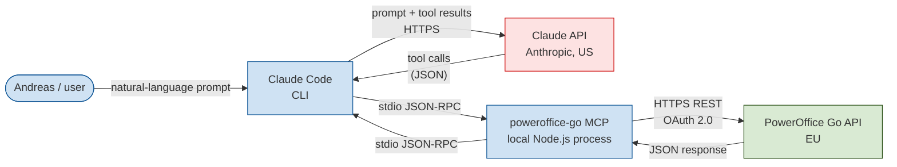
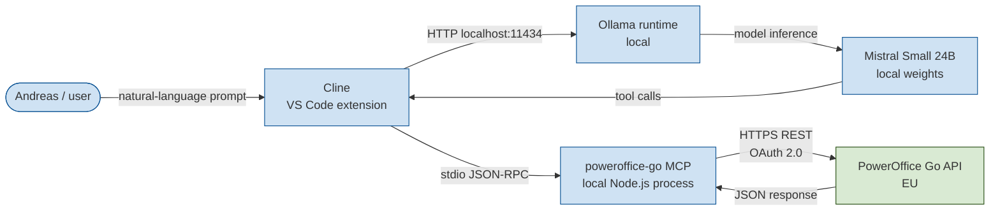

# PowerOffice Go MCP Server

[](https://github.com/smplas/poweroffice-go-mcp/actions/workflows/ci.yml)
[](https://github.com/smplas/poweroffice-go-mcp/actions/workflows/codeql.yml)

An MCP (Model Context Protocol) server that exposes a curated, **draft-only** subset of the PowerOffice Go API to AI assistants such as Claude Code, Cursor, Cline, and GitHub Copilot.

Built by [SmplCo](https://smpl.no/) for use in the demonstration at **Tech-Forum Stavanger, 4 June 2026** with [CMS Kluge Advokatfirma](https://cms.law/en/nor/). This repository is the codebase that the lawyers and audience will be reviewing.

---

## Why this exists

We wanted to find out, in public, how far a small business can take AI-assisted automation of an accounting workflow — and what the legal and practical limits actually are.

Rather than running the experiment behind closed doors and presenting a polished outcome, we built a working integration against the real PowerOffice Go API, opened up the source code, and invited Norwegian tech lawyers to stress-test it live.

---

## Design principles

The server is built around four deliberate constraints:

1. **Draft-only.** The server can create, read, update, and delete *draft* sales orders. It **cannot** send invoices, issue invoices, send payment reminders, or take any action with external effect. A human must log into PowerOffice Go's UI to do that. The relevant tools simply do not exist in the code — see [Why there is no `send_invoice`](#why-there-is-no-send_invoice).
2. **Human-in-the-loop by architecture, not by promise.** The safety guarantee is enforced by the absence of write-finalisation tools, not by a configuration flag or system prompt.
3. **Auditable by default.** Every tool call is appended to an audit log (`~/.poweroffice-mcp/audit.log`) with timestamp, tool name, arguments, outcome and duration. See [Audit logging](#audit-logging).
4. **No secrets in the repo.** Credentials are passed via environment variables. The repo is safe to share.

---

## Data flow

### Setup A — Cloud frontier model (Anthropic Claude)



What crosses the Atlantic: every user message, every tool input, and every tool output (customer names, invoice amounts, etc.) — sent to Claude so it can reason over them.

### Setup B — Local model (Mistral Small via Ollama)



What crosses the Atlantic: **nothing**. The model runs on the user's laptop. The only outbound traffic is to PowerOffice Go's EU-based API.

---

## What the server can do

As of 0.4.0 the server covers sales, purchases, bookkeeping, payroll, time tracking
and bank *reading*, across one or many Go clients.

| Area | Read | Write |
|---|---|---|
| Companies | `list_companies`, `get_integration_info`, `list_partner_clients`, `get_partner_client_users`, `get_partner_client_access_roles` | *(none)* |
| Customers | `list_customers`, `get_customer`, `search_customers`, `list_contact_persons` | `create_customer`, `create_contact_person`, `archive_customer`, `delete_customer` |
| Products | `list_products`, `get_product` | `create_product`, `update_product` |
| Sales orders | `list_invoices`, `get_invoice` | `create_draft_invoice`, `update_draft_invoice`, `delete_draft_invoice`, `add_invoice_attachment` |
| Outgoing invoices (sent) | `list_outgoing_invoices`, `get_outgoing_invoice` | *(none — strictly read-only)* |
| Customer ledger | `get_customer_balances`, `get_open_items`, `get_customer_statement` | *(none)* |
| Suppliers | `list_suppliers`, `get_supplier`, `list_supplier_payment_terms` | `create_supplier`, `update_supplier`, `delete_supplier` |
| Supplier ledger | `get_supplier_balances`, `get_supplier_open_items`, `get_supplier_statement` | *(none)* |
| Incoming invoices | `list_incoming_invoices`, `get_incoming_invoice` | *(none — record purchases as supplier-invoice vouchers)* |
| Voucher drafts | `list_voucher_drafts`, `get_voucher_draft`, `get_voucher_ehf` | `create_voucher_draft`, `update_voucher_draft`, `add_voucher_line`, `update_voucher_line`, `delete_voucher_line`, `delete_voucher_draft`, `add_voucher_page`, `delete_voucher_page`, `submit_voucher_for_approval` |
| Posting to the ledger | `get_posted_voucher` | `post_voucher`, `reverse_voucher` |
| Voucher approval | `list_vouchers_for_approval`, `list_voucher_documentation` | `respond_to_voucher_approval`, `replace_voucher_documentation` |
| General ledger | `get_trial_balance`, `list_account_transactions`, `list_gl_accounts`, `get_gl_account`, `get_financial_settings`, `get_lock_date`, `get_vat_settings`, `get_currency_rate`, `list_sub_ledger_number_series` | `create_gl_account`, `update_gl_account`, `delete_gl_account` |
| Payroll | `list_pay_items`, `get_pay_item`, `get_payroll_settings`, `list_salary_lines`, `get_salary_line` | `create_salary_line`, `update_salary_line`, `delete_salary_line` |
| Time tracking | `list_time_records`, `get_time_record`, `list_hour_types`, `list_time_transactions` | `create_time_entry`, `update_time_entry`, `create_time_activity`, `delete_time_record` |
| Bank | `list_client_bank_accounts`, `get_client_bank_account`, `list_bank_approvers`, `list_bank_transfers`, `get_bank_transfer` | *(none — read-only by design)* |
| Employees | `list_employees`, `get_employee` | *(none)* |
| Dimensions | `list_departments`, `list_projects` | `create_project` |
| Settings | `list_vat_codes`, `list_payment_terms`, `list_branding_themes`, `list_currencies` | *(none)* |
| Prospects | `list_customer_prospects` | `convert_prospect_to_customer` |
| Validation | `validate_invoice` | *(read-only)* |

### The safety boundary in 0.4.0

0.3.0 was draft-only: nothing it did changed the general ledger. 0.4.0 deliberately
crosses that line — `post_voucher` books entries, and `create_salary_line` feeds
payroll — because bookkeeping was the point. The boundary moved; it did not vanish:

- **No external effect.** Nothing is sent to a customer, a supplier or a debt
  collector. No invoices, no credit notes, no reminders.
- **No money movement.** `POST`/`DELETE /BankTransfers` and every write to
  `/ClientBankAccounts` are absent. Bank data is read-only: every API call in
  `src/tools/bank.ts` is a read.
- **Posting and deleting require `confirm=true`.** A speed bump against a misread
  instruction, not a security control. The control is the absence above.
- **Reversal, not deletion.** A posted voucher is corrected with `reverse_voucher`,
  which is what Norwegian bookkeeping rules require.

The list of what is deliberately absent is in `src/utils/safety.ts` and is returned
by `list_companies`, so an assistant can read its own limits.

## Multiple companies (multi-tenant)

PowerOffice issues one **client key per Go client**, and an access token belongs to
exactly one client key. PowerOffice's own guidance warns that sharing token state
between clients risks reading or writing the wrong company's books — so isolation
here is structural rather than careful:

- One `PowerOfficeClient` per configured company, each with its own token cache and
  rate limiter. Nothing is shared between them.
- The company is resolved once per tool call and carried in an `AsyncLocalStorage`
  context for that call's whole async extent. Concurrent calls for different
  companies cannot observe each other (`tests/registry.test.ts` asserts this under
  deliberate interleaving).
- Every tool takes a `client` argument. **Writes must name the company explicitly**
  whenever more than one is configured — even if a default is set. A read may use
  the default; booking to the wrong company may not be guessed at.
- A tool that somehow runs without a resolved company throws rather than falling
  back to one.

Point `POWEROFFICE_CLIENTS` at a JSON file:

```json
{
  "apiUrl": "https://goapi.poweroffice.net",
  "appKey": "...",
  "subscriptionKey": "...",
  "defaultClient": "acme",
  "clients": {
    "acme":  { "label": "Acme AS",  "clientKey": "..." },
    "bolig": { "label": "Bolig AS", "clientKey": "..." }
  }
}
```

Call `list_companies` to see the aliases. The single-client environment variables
still work unchanged when `POWEROFFICE_CLIENTS` is not set.

If the key belongs to a PowerOffice **partner** (an accounting firm),
`list_partner_clients` enumerates the clients the partner can reach via
`/ClientAdmin/Clients`. On an ordinary client key PowerOffice rejects it, which is
the correct answer rather than a bug.

## Why there is no `send_invoice`

PowerOffice Go's API supports sending invoices and other state-changing operations. We deliberately did **not** expose them as MCP tools.

The architectural choice is:

- Tools that have **no external visible effect** (drafts, internal records) are exposed.
- Tools that **create external obligations** (invoices sent to customers, payment reminders, debt collection notices) are not exposed.

A reviewer can verify this by searching the codebase for `send`, `issue`, `finalize`, `remind` or `collect` — no such tools exist. (Since 0.4.0 the codebase does contain `post_voucher`, which posts to the general ledger; see the safety boundary above for what that does and does not allow.) If we wanted to add them later, it would require an explicit code change, a code review, and a deliberate redeployment.

---

## Audit logging

Every tool invocation is logged as one JSON line in `~/.poweroffice-mcp/audit.log` (configurable via the `POWEROFFICE_AUDIT_LOG` environment variable). Format:

```json
{"ts":"2026-05-27T07:14:22.118Z","tool":"create_draft_invoice","args":{"customerId":27469244,"lines":[...]},"status":"ok","durationMs":634}
```

The log records:
- Timestamp (UTC, ISO-8601)
- Tool name
- Input arguments (after Zod validation)
- Outcome (`ok` or `error`)
- Duration in milliseconds
- Error message on failure

The log is append-only from the server's side. It is **not** uploaded anywhere — it lives on the machine running the MCP server.

---

## Testing and continuous integration

The repository ships with a [Vitest](https://vitest.dev/) test suite. Run it locally with:

```bash
npm test
```

Tests cover the rate limiter, the audit log, the JSON-Patch body conversion, the URL-encoding helper, and the invoice validator. The full test suite runs on every push and pull request via [GitHub Actions](./.github/workflows/ci.yml), along with `npm audit`, `tsc`, and the `npm run build` step.

[GitHub CodeQL](./.github/workflows/codeql.yml) runs the `security-and-quality` query suite on every push, every PR, and on a weekly cron — so a vulnerability disclosed after a release will surface on the next scan even without a new commit.

[Dependabot](./.github/dependabot.yml) opens weekly PRs for npm updates and monthly PRs for GitHub Actions updates.

## Dependencies

Two runtime dependencies, both [MIT licensed](https://opensource.org/licenses/MIT):

- [`@modelcontextprotocol/sdk`](https://github.com/modelcontextprotocol/typescript-sdk) — the official MCP SDK from Anthropic
- [`zod`](https://github.com/colinhacks/zod) — schema validation

No code was copied from third-party repositories. Everything in `src/` was written for this project. All HTTP calls use the platform-native `fetch` API in Node.js 20+.

---

## Running it

```bash
git clone <this-repo>
cd PoGoMCP
npm install
npm run build

export POWEROFFICE_API_URL="https://goapi.poweroffice.net/Demo"
export POWEROFFICE_APP_KEY="..."
export POWEROFFICE_CLIENT_KEY="..."
export POWEROFFICE_SUBSCRIPTION_KEY="..."

node dist/index.js
```

To connect from Claude Code, add the following block to `~/.claude.json` under `mcpServers`:

```json
"poweroffice-go": {
  "command": "node",
  "args": ["/absolute/path/to/PoGoMCP/dist/index.js"],
  "env": {
    "POWEROFFICE_API_URL": "https://goapi.poweroffice.net/Demo",
    "POWEROFFICE_APP_KEY": "...",
    "POWEROFFICE_CLIENT_KEY": "...",
    "POWEROFFICE_SUBSCRIPTION_KEY": "..."
  }
}
```

For Cline (VS Code / Cursor), see `cline_mcp_settings.json` under the Cline extension's global storage directory.

---

## How it was built

The entire codebase was developed by Andreas Melvær (a designer, not a full-time developer) through natural-language conversation with **Claude Code (Anthropic)**, on a Claude Max plan with training-data sharing disabled.

The development process itself is part of the demonstration: how far can a non-developer take a real API integration, with current AI tooling, in a single working session?

---

## Acknowledgements

Thank you to **PowerOffice Go** for providing API access for this experiment and for being genuinely open to customers and partners building on top of their platform.

Thank you to **CMS Kluge Advokatfirma**, in particular Ove André Vanebo and Bernt Olav Thorsheim, for agreeing to scrutinise this in public.

---

## Terms, data, and privacy

Use of the PowerOffice Go API through this integration is governed by the [Visma Developer Terms](https://developer.visma.com/). Production data access requires the customer's authorisation, and the integration's registered "intended use" forms part of that agreement.

For any customer-facing deployment, SmplCo AS provides its own end-user terms and privacy policy describing the integration and the data it processes. In line with the Developer Terms, Data is kept to the minimum required, used only for the customer's own purposes, not shared with third parties except as needed to operate the integration, and deleted when the customer's use ends.

Important: when the integration is driven by a cloud LLM, tool inputs and outputs are processed by that model provider (see Setup A under [Data flow](#data-flow)). For real personal data, use an enterprise LLM plan with a data processing agreement, or a local model, as described in [SECURITY.md](./SECURITY.md).

---

## Trademarks

PowerOffice Go and Visma are trademarks of Visma AS. This is an independent integration built by SmplCo AS. It is not made, sponsored, or endorsed by Visma AS or PowerOffice AS.

---

## License

MIT — see [LICENSE](./LICENSE).

This code is provided for educational and demonstrative purposes. It is not a production-ready integration and should not be deployed against live financial data without independent review.
